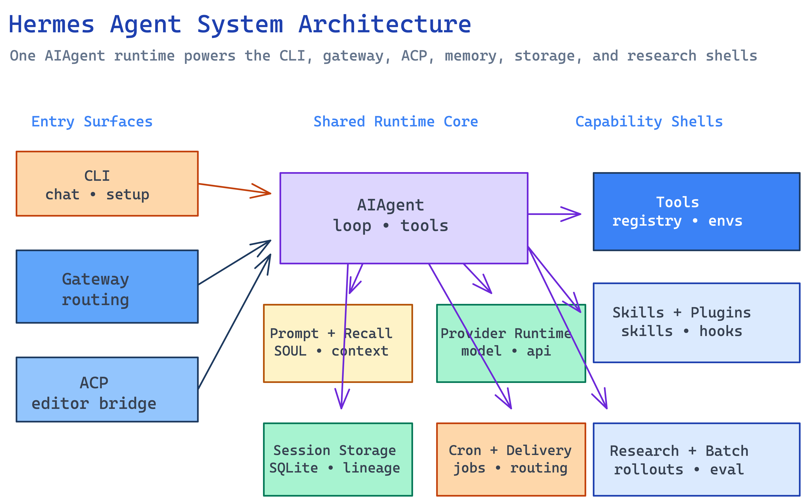

# Hermes Agent Architecture Overview

> High-level orientation to Hermes Agent as a multi-surface agent platform rather than a single chat loop.

## Overview

Hermes Agent is best understood as a shared runtime core wrapped by several product surfaces. The center of gravity is [`AIAgent`](../entities/agent-loop-runtime.md), implemented in `run_agent.py`, but the repository is not only a CLI assistant. The same runtime is reused by the interactive terminal app, the long-running messaging [gateway runtime](../entities/gateway-runtime.md), the [ACP adapter](../entities/acp-adapter.md) for editors, the [cron system](../entities/cron-system.md), and the research-oriented batch and environment stack described in [research and batch surfaces](../entities/research-and-batch-surfaces.md).

What makes Hermes distinctive is that the runtime core is surrounded by persistent context machinery. Prompt assembly is not just a string builder; it merges agent identity from `SOUL.md`, local memory snapshots, skill indexes, project context files, and per-platform overlays. Tool execution is not just JSON schema dispatch; it includes toolset selection, availability checks, approval-gated terminal execution, MCP discovery, and multiple execution backends. Session continuity is not just in-memory history; it spans SQLite persistence, FTS5 search, gateway session metadata, lineage across compression boundaries, and optional external memory providers.

The repo's own developer guide reflects this architecture. Files such as `website/docs/developer-guide/architecture.md`, `agent-loop.md`, `prompt-assembly.md`, `provider-runtime.md`, `tools-runtime.md`, `gateway-internals.md`, and `session-storage.md` are not side docs around the codebase; they mirror the major ownership boundaries that show up in the source tree itself.

[Edit diagram source](../assets/graphs/hermes-agent-architecture.excalidraw)

## Major Subsystems

| Subsystem | Runtime role | Primary source anchors | Wiki page |
|------|------|------|------|
| Agent loop | Turn orchestration, retries, tool loops, callbacks, compression, fallback | `run_agent.py`, `website/docs/developer-guide/agent-loop.md` | [Agent Loop Runtime](../entities/agent-loop-runtime.md) |
| Prompt system | Stable system prompt construction and ephemeral overlays | `agent/prompt_builder.py`, `agent/prompt_caching.py`, `website/docs/developer-guide/prompt-assembly.md` | [Prompt Assembly System](../entities/prompt-assembly-system.md) |
| Provider runtime | Provider/model/auth resolution for primary and auxiliary calls | `hermes_cli/runtime_provider.py`, `hermes_cli/auth.py`, `agent/auxiliary_client.py` | [Provider Runtime](../entities/provider-runtime.md) |
| Tool runtime | Registration, toolset filtering, dispatch, environment bridging | `tools/registry.py`, `model_tools.py`, `tools/approval.py` | [Tool Registry and Dispatch](../entities/tool-registry-and-dispatch.md) |
| Memory and recall | Built-in memory, external providers, session search, recall injection | `agent/memory_manager.py`, `agent/memory_provider.py`, `plugins/memory/*` | [Memory and Learning Loop](../entities/memory-and-learning-loop.md) |
| Session persistence | Long-lived storage for messages, titles, lineage, and search | `hermes_state.py`, `gateway/session.py` | [Session Storage](../entities/session-storage.md) |
| Product shells | CLI, gateway, ACP, cron, and research runners | `hermes_cli/main.py`, `gateway/run.py`, `acp_adapter/server.py`, `cron/scheduler.py`, `batch_runner.py` | [CLI Runtime](../entities/cli-runtime.md), [Gateway Runtime](../entities/gateway-runtime.md), [ACP Adapter](../entities/acp-adapter.md) |

The repository layout reflects these boundaries. Top-level Python files such as `run_agent.py`, `model_tools.py`, and `hermes_state.py` act as cross-cutting runtime nodes, while package directories such as `agent/`, `tools/`, `hermes_cli/`, `gateway/`, `cron/`, `acp_adapter/`, and `plugins/memory/` each own a specific layer of the product.

## Execution Model

Most Hermes flows converge on the same runtime sequence:

1. An entry surface receives user intent. In the CLI that happens through `hermes_cli/main.py` and the interactive chat shell. In the gateway it happens through a platform adapter that normalizes an inbound event. In ACP it happens through a JSON-RPC prompt call on an editor-managed session.
2. The surface resolves configuration, model/provider settings, enabled toolsets, and the active `HERMES_HOME` profile. This is the job of the [config and profile system](../entities/config-and-profile-system.md), [CLI runtime](../entities/cli-runtime.md), and [provider runtime](../entities/provider-runtime.md).
3. Hermes constructs or restores a conversation context. That may mean loading a session from SQLite, building gateway session metadata, or creating a fresh cron session with no prior history.
4. `AIAgent.run_conversation()` assembles the effective system prompt, determines API mode, injects memory and context overlays, issues a model call, and either returns a final response or enters a tool loop.
5. Tool calls flow through the [tool registry and dispatch](../entities/tool-registry-and-dispatch.md), which may route to local tools, remote execution environments, skill/document helpers, memory providers, or approval-gated terminal commands.
6. After each turn, Hermes persists messages, updates or queues memory-provider sync, optionally compresses context, and returns the response through the originating shell.

This shared model is why Hermes can support dramatically different user surfaces without duplicating the agent logic. The surfaces differ mostly in session acquisition, callback presentation, approval transport, and delivery behavior. The loop itself stays centered on `run_agent.py`.

## Architectural Themes

### One runtime, many shells

Hermes deliberately resists splitting the system into separate per-surface agents. The CLI, gateway, ACP adapter, cron scheduler, and research stack all reuse the same agent loop and the same provider and tool runtime. That keeps tool behavior, model routing, and session semantics aligned even when the user moves between a terminal, a messaging thread, and an editor.

### Filesystem-first identity and context

The repo uses the filesystem as an explicit configuration and identity surface. `HERMES_HOME` contains `SOUL.md`, `config.yaml`, `.env`, memory files, cron state, logs, and installed skills. Project context is discovered from files such as `.hermes.md`, `HERMES.md`, `AGENTS.md`, `CLAUDE.md`, or Cursor rules. This makes Hermes configurable without hardcoding every policy into Python classes, but it also means the prompt system has to enforce strict ordering and sanitization rules.

### Capability governance via toolsets and readiness

Hermes does not expose every tool to every session. Tool availability depends on selected toolsets, per-platform presets, runtime readiness checks, secrets, and dynamic discovery of MCP or plugin-provided tools. The system can therefore expose a narrow editor-safe `hermes-acp` surface, a broader CLI surface, or a gateway-specific set without changing the model loop itself.

### Persistence as a runtime primitive

Persistence is part of normal operation, not an afterthought. SQLite session storage, memory files, session search, compression summaries, and external memory-provider plugins all exist so that long-running or cross-session workflows remain practical. This is the basis for Hermes' "self-improving agent" framing rather than a stateless assistant loop.

## Entry Points for Newcomers

For implementation work, the most effective reading order is:

1. `website/docs/developer-guide/architecture.md` for the repo-wide map.
2. `run_agent.py` and [Agent Loop Runtime](../entities/agent-loop-runtime.md) for the actual execution spine.
3. `agent/prompt_builder.py`, `agent/context_compressor.py`, and [Prompt Assembly System](../entities/prompt-assembly-system.md) to understand how context is constructed and preserved.
4. `hermes_cli/runtime_provider.py` and [Provider Runtime](../entities/provider-runtime.md) to understand why the same agent can speak to multiple provider families.
5. `tools/registry.py`, `model_tools.py`, and [Tool Registry and Dispatch](../entities/tool-registry-and-dispatch.md) to see how capabilities reach the model.
6. `gateway/run.py` and [Gateway Runtime](../entities/gateway-runtime.md) if the work involves messaging surfaces or long-running sessions.
7. `hermes_state.py` and [Session Storage](../entities/session-storage.md) if the work involves recall, continuity, or compression side effects.

Readers who care about higher-level mechanics rather than a single subsystem should then move into [Self-Improving Agent Architecture](../concepts/self-improving-agent-architecture.md), [Prompt Layering and Cache Stability](../concepts/prompt-layering-and-cache-stability.md), and [Gateway Message to Agent Reply Flow](../syntheses/gateway-message-to-agent-reply-flow.md).

## See Also

- [Codebase Map](codebase-map.md)
- [Agent Loop Runtime](../entities/agent-loop-runtime.md)
- [Gateway Runtime](../entities/gateway-runtime.md)
- [Self-Improving Agent Architecture](../concepts/self-improving-agent-architecture.md)
